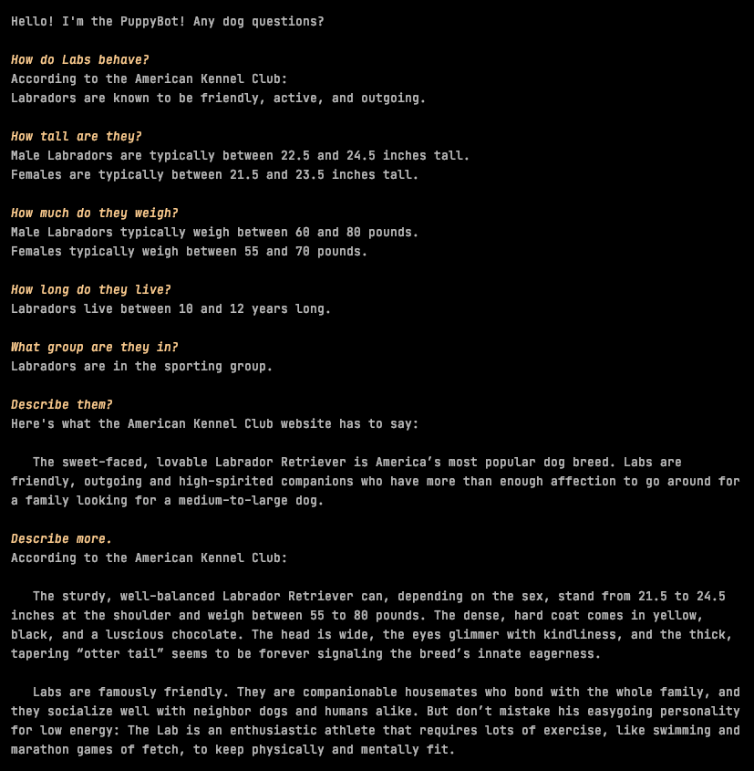
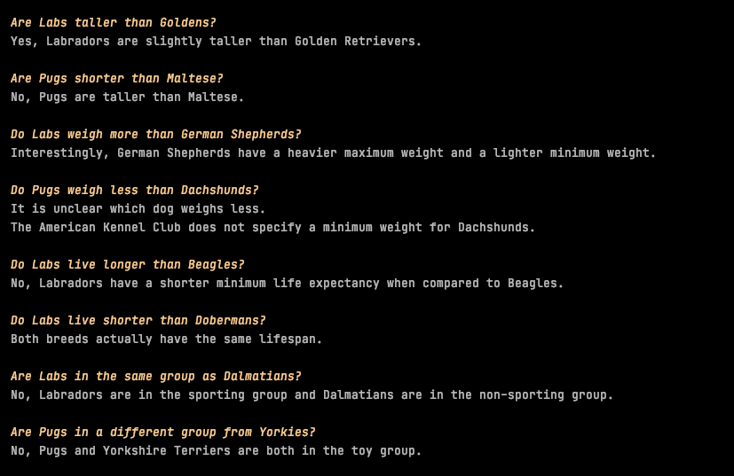

# PuppyChat
Welcome to PuppyChat! This is a project meant to showcase my skills in the python programming
language. PuppyChat intelligently answers trivia questions about the American Kennel Club's top 60 most popular dog breeds from 2019. You can ask about specific dogs, compare two dogs, or even compare one dog to the rest.

**NOTE:** All of the dog breed information is sourced from the American Kennel Club's Website. None of the information supplied is mine.

## Setup
___
1. Install Python (version 3.7 reccomended)
2. Download and unzip the zip file
3. On your IDE of choice, open the source code 
4. Run PuppyChat.py

## PuppyChat in Action
___

PuppyChat can answer trivia questions about these attributes for all 60 of PuppyChat's supported breeds:

* Temperament
* Height
* Weight
* Lifespan
* Group Membership
* Basic description
* Detailed description

 PuppyChat can also compare difference dog breeds on the following attributes:

* Height
* Weight
* Lifespan
* Group Membership

 PuppyChat can also make one-to-all comparisons between breeds on the same four attributes listed above:

 As a bonus, it also can give a list of the members within a certain group:

## Contributing
___

Because this is only a personal side project, PuppyChat is not open to contributors.

## Support
---
Any questions? Email me at anthonyleedebem@gmail.com
